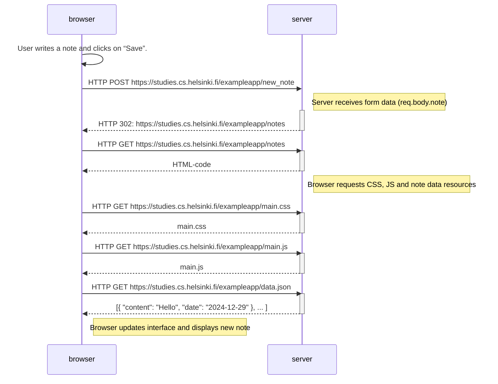

```mermaid
sequenceDiagram
    participant browser
    participant server

    browser->>browser: User writes a note and clicks on “Save”.

    browser->>server: HTTP POST https://studies.cs.helsinki.fi/exampleapp/new_note
    Note right of server: Server receives form data (req.body.note)

    activate server
    server-->>browser: HTTP 302: https://studies.cs.helsinki.fi/exampleapp/notes
    deactivate server

    browser->>server: HTTP GET https://studies.cs.helsinki.fi/exampleapp/notes
    activate server
    server-->>browser: HTML-code
    deactivate server

    Note right of server: Browser requests CSS, JS and note data resources
    browser->>server: HTTP GET https://studies.cs.helsinki.fi/exampleapp/main.css
    activate server
    server-->>browser: main.css
    deactivate server

    browser->>server: HTTP GET https://studies.cs.helsinki.fi/exampleapp/main.js
    activate server
    server-->>browser: main.js
    deactivate server

    browser->>server: HTTP GET https://studies.cs.helsinki.fi/exampleapp/data.json
    activate server
    server-->>browser: [{ "content": "Hello", "date": "2024-12-29" }, ... ]
    deactivate server

    Note right of browser: Browser updates interface and displays new note
```