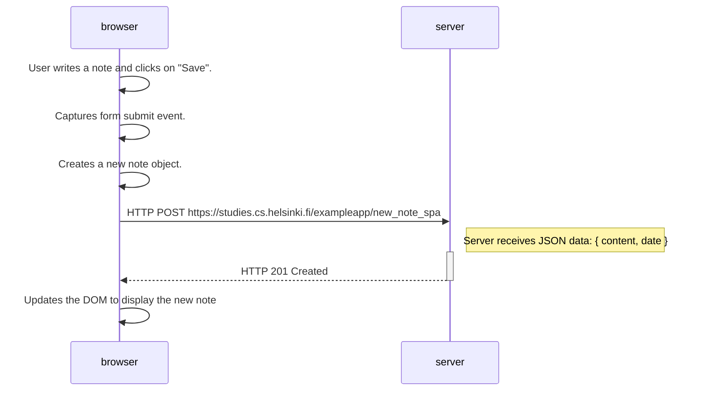

```mermaid
sequenceDiagram
    participant browser
    participant server

    browser->>browser: User writes a note and clicks on "Save".

    browser->>browser: Captures form submit event.

    browser->>browser: Creates a new note object.

    browser->>server: HTTP POST https://studies.cs.helsinki.fi/exampleapp/new_note_spa
    Note right of server: Server receives JSON data: { content, date }
    activate server
    server-->>browser: HTTP 201 Created
    deactivate server

    browser->>browser: Updates the DOM to display the new note
```